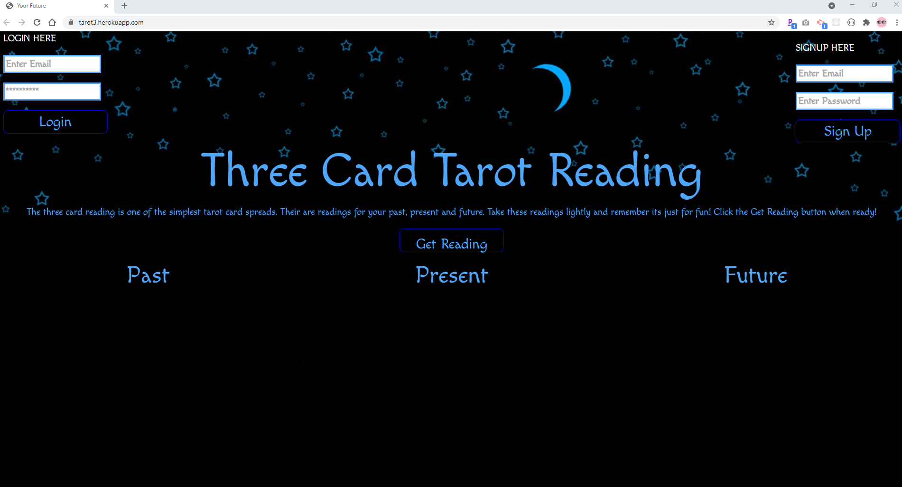
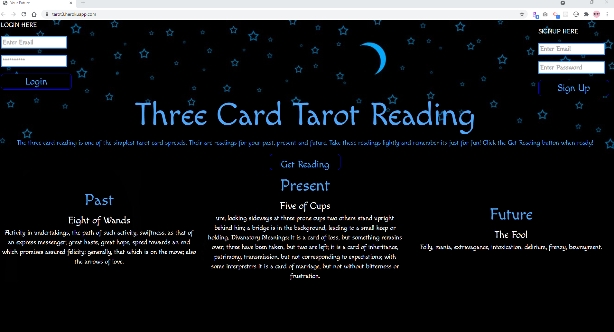

<h1 align="center">Welcome to Project 2 Tarot3 👋</h1>
<p>
  
  <a href="#" target="_blank">
    
  </a>
</p>

> Tarot reading of 3 random tarot cards with brief description of the meaning of each card. The user will set up a user account with an email and password. This is to establish a database of users to eventually tie readings to.

### 🏠 [Homepage](https://github.com/kcnancy/tarot3/tree/main)

### ✨ [Demo](https://tarot3.herokuapp.com/)

## Install

```sh
npm install
```

## Usage

```sh
npm run start
```





## Author

👤 **Nancy McBride & Daniel Nau**

* Github: https://github.com/kcnancy and https://github.com/dannauu


***
_This README was generated with ❤️ by [readme-md-generator](https://github.com/kefranabg/readme-md-generator)_